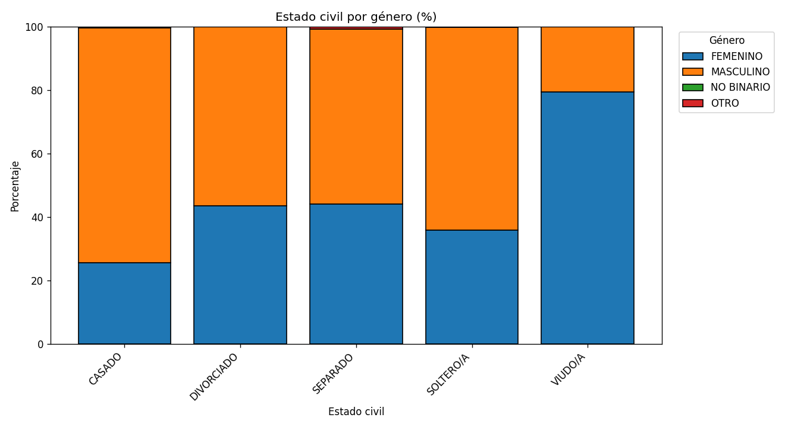

# Análisis familiar
_Actualizado: 2025-08-29 10:52_
_Fuente de datos: `reportes/datos_limpios.xlsx`_

## Preguntas y respuestas
1. **¿Qué porcentaje del personal está casado?**  
**60.55%**

2. **¿Cuántos tienen hijos y cuántos viven con ellos?**
- Con hijos: **3669**
- Viven con familia/hijos: **1185**

3. **¿Hay relación entre edad y estado civil?**
Sí. Los resultados muestran que los **solteros presentan edades más bajas**, mientras que los **casados tienen una edad promedio intermedia**. En contraste, los **divorciados y viudos concentran edades mayores**. Esto indica una relación evidente: a mayor edad, es más probable que el estado civil cambie de soltero a casado, separado o viudo.

## Visualizaciones


## Resumen tabular
```
 count      mean  median
    39 47.564103    49.0
   161 40.875776    40.0
   250 40.352000    39.0
  3889 39.681666    38.0
  2084 30.233685    28.0
```

## Nueva sección: Cruces y métricas familiares
- Esta sección agrega cruces entre **estado civil y género**, así como **indicadores de hijos**.

### Estado civil × Género (porcentaje por estado civil)
```
Estado civil  FEMENINO  MASCULINO  NO BINARIO  OTRO
      CASADO     25.64      74.03        0.05  0.28
  DIVORCIADO     43.60      56.40        0.00  0.00
    SEPARADO     44.10      55.28        0.00  0.62
   SOLTERO/A     35.84      64.01        0.00  0.14
     VIUDO/A     79.49      20.51        0.00  0.00
```




### Hijos por estado civil
```
Estado civil  pct_con_hijos
      CASADO          76.91
  DIVORCIADO          77.60
    SEPARADO          88.20
   SOLTERO/A          14.68
     VIUDO/A          92.31
```


### Convivencia (entre quienes tienen hijos)
```
Estado civil  Pct convive con familia (entre quienes tienen hijos)
      CASADO                                                 12.34
  DIVORCIADO                                                 21.13
    SEPARADO                                                 26.76
   SOLTERO/A                                                 31.37
     VIUDO/A                                                 13.89
```