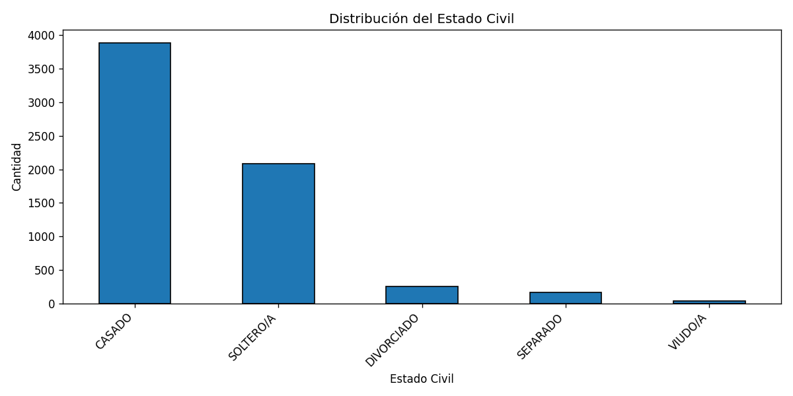

# Análisis familiar
_Actualizado: 2025-08-27 13:42_

## Preguntas y respuestas
1. **¿Qué porcentaje del personal está casado?**  
**60.55%**

2. **¿Cuántos tienen hijos y cuántos viven con ellos?**
- Con hijos: **3669**
- Viven con familia/hijos: **1185**

3. **¿Hay relación entre edad y estado civil?**

Sí. Los resultados muestran que los **solteros presentan edades más bajas**, mientras que los **casados tienen una edad promedio intermedia**. En contraste, los **divorciados y viudos concentran edades mayores**. Esto indica una relación evidente: a mayor edad, es más probable que el estado civil cambie de soltero a casado, separado o viudo.

## Visualizaciones



## Resumen tabular
```
 count      mean  median
    39 47.564103    49.0
   161 40.875776    40.0
   250 40.352000    39.0
  3881 39.687194    38.0
  2079 30.217412    28.0
```
