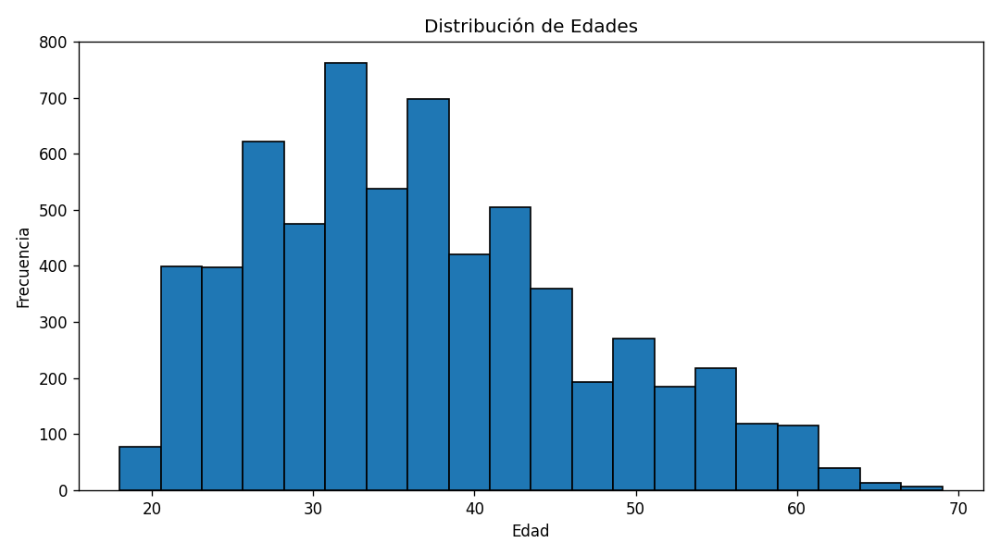
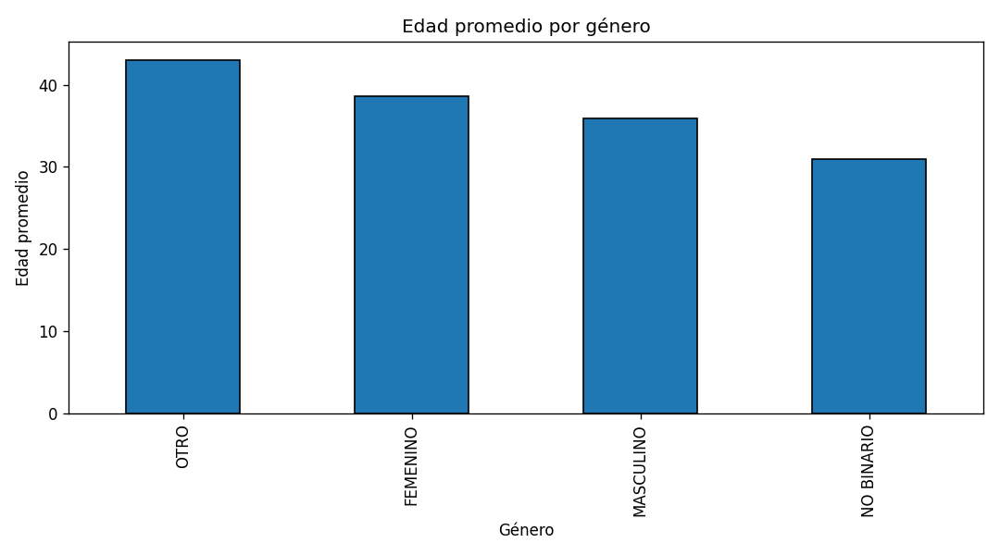
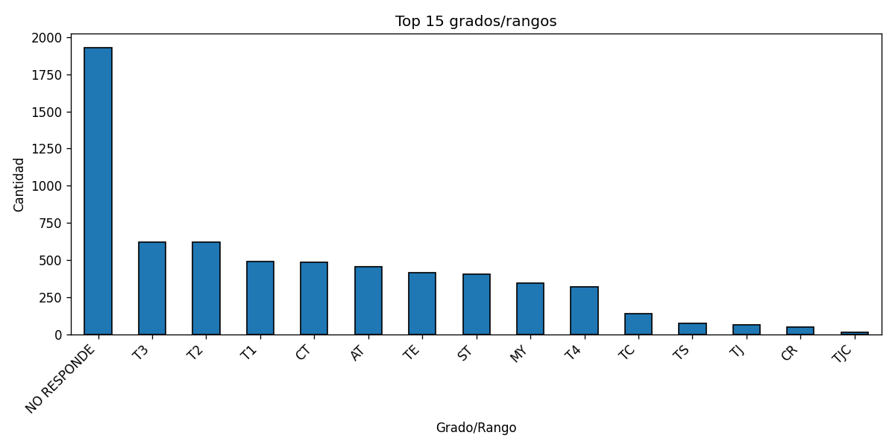

# Demografía básica
_Actualizado: 2025-08-29 10:52_
_Fuente de datos: `reportes/datos_limpios.xlsx`_

## Resumen general
- Total de registros: **6423**
- Total de columnas: **231**
- Edad promedio: **36.7**  | mín **18**, máx **69**

## Preguntas y respuestas
1. **¿Cuál es el rango de edad más común?**  
**25-34**

2. **¿Hay diferencias en la distribución por género?**
```
| Género    | Cantidad |
|-----------|----------|
| MASCULINO | 4451     |
| FEMENINO  | 1955     |
| SIN DATO  | 15       |
| OTRO      | 2        |

```

3. **¿Cuál es el grado militar más frecuente?**
**NO RESPONDE**

## Visualizaciones







